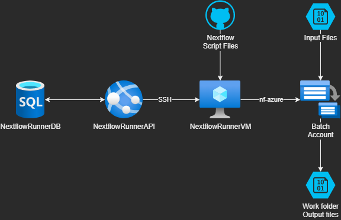

# Introduction

## What?
A lightweight application designed to allow users to run Nextflow jobs without setting up Nextflow on Azure. It allows users to bring their own data, select from a list of preconfigured pipelines and execute a pipeline.

All output is stored in an Azure storage account and can be downloaded for further downstream processing.

## Why?
Nextflow is a commonly used workflow manager in the scientific community. By providing  a sandox type environment for users, users can quickly validate their data and generate data for further analysis without having to learn or configure nextflow jobs.

# Getting started

## Nextflow Cloud Runner
Run a Nextflow pipeline in the cloud

## Requirements
This project has three parts, a database project, an Minimal API project, and a Blazor UI application. We've also included the necessary bicept templates to create and deploy the resources on Azure.

## Running locally
You can download and run the projects locally, .NET 6.0 is required.

## Running on Azure
You can use the provided bicep templates to deploy and run on Azure.

## Contributing

This project welcomes contributions and suggestions.  Most contributions require you to agree to a
Contributor License Agreement (CLA) declaring that you have the right to, and actually do, grant us
the rights to use your contribution. For details, visit https://cla.opensource.microsoft.com.

When you submit a pull request, a CLA bot will automatically determine whether you need to provide
a CLA and decorate the PR appropriately (e.g., status check, comment). Simply follow the instructions
provided by the bot. You will only need to do this once across all repos using our CLA.

This project has adopted the [Microsoft Open Source Code of Conduct](https://opensource.microsoft.com/codeofconduct/).
For more information see the [Code of Conduct FAQ](https://opensource.microsoft.com/codeofconduct/faq/) or
contact [opencode@microsoft.com](mailto:opencode@microsoft.com) with any additional questions or comments.

## Trademarks

This project may contain trademarks or logos for projects, products, or services. Authorized use of Microsoft 
trademarks or logos is subject to and must follow 
[Microsoft's Trademark & Brand Guidelines](https://www.microsoft.com/en-us/legal/intellectualproperty/trademarks/usage/general).
Use of Microsoft trademarks or logos in modified versions of this project must not cause confusion or imply Microsoft sponsorship.
Any use of third-party trademarks or logos are subject to those third-party's policies.
